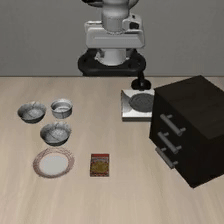
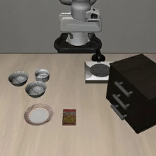
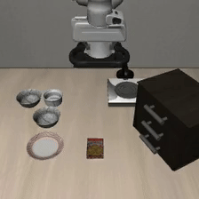
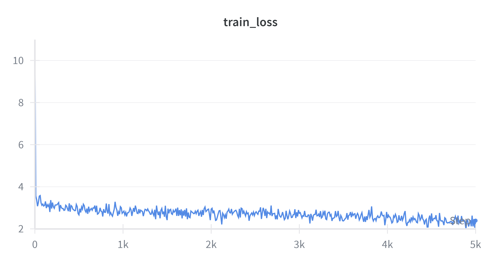
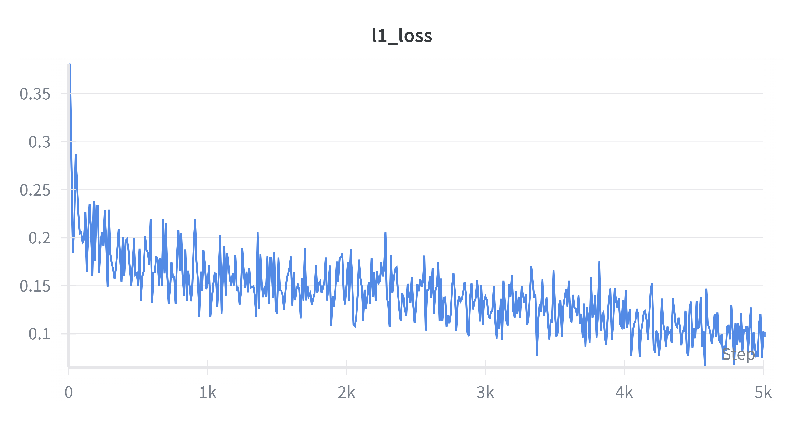
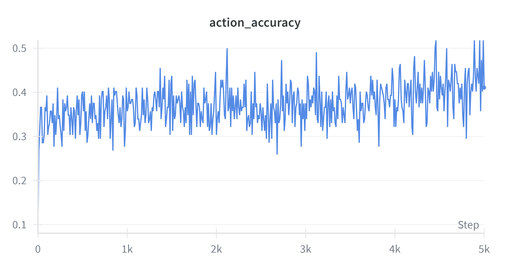

# OpenVLA-7B: Libero 仿真复现 (RTX 4090)

<div align="center">

[](LICENSE)
[](https://www.python.org/)
[]()


</div>

## ✨ 效果展示 (Libero-Spatial)


| ✅ 成功抓取  | ⚠️ 二次抓取但失败 |
| :---: | :---: |
|  |  |


| ❌ 没抓到  | ❌ 放置位置没对准 |
| :---: | :---: |
|  |  |


## 📊 训练监控与指标 (WandB)

我们在 5000 步的微调过程中，Loss 呈现稳定下降趋势，动作预测准确率逐步提升。

| 📉 Train Loss  | 📉 L1  Loss  |
| :---: | :---: |
|  |  |


| 📈 Action Accuracy  | 💾 GPU Memory  |
| :---: | :---: |
|  |  |


### 📈 关键指标详情

| 监控指标  | 最终数值  | 说明  |
| :--- | :---: | :--- |
| **Train Loss** | **~2.0** | 整体收敛正常，未出现梯度爆炸 |
| **L1  Loss** | **~0.1** | 反映机械臂动作坐标的回归误差，越低越精准 |
| **Action Accuracy** | **40% - 50%** | 对于连续控制任务，此准确率已具备泛化能力 |
| **GPU Memory** | **~23GB** | 显存优化策略有效 |


## 📄 License & Citation

本项目基于 [OpenVLA](https://github.com/openvla/openvla) 修改，遵循 MIT License。

```bibtex
@article{kim2024openvla,
  title={OpenVLA: An Open-Source Vision-Language-Action Model},
  author={Kim, Moo Jin and other authors...},
  journal={arXiv preprint arXiv:2406.09246},
  year={2024}
}
```


